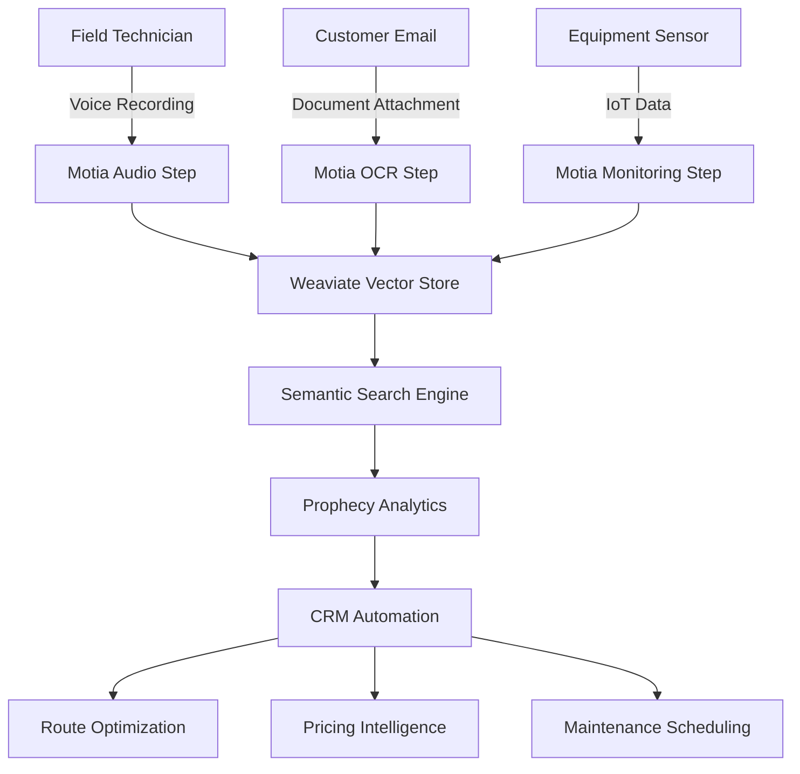

# 🔮 PROPHECY SYSTEM INTEGRATION PRD
## Motia.dev + Weaviate HVAC CRM Enhancement

**Document Version:** 1.0  
**Date:** 2025-01-12  
**Project:** HVAC CRM Prophecy System Integration  
**Target:** 137/137 Godlike Quality Standard  

---

## 🎯 **EXECUTIVE SUMMARY**

### **Vision Statement**
Transform our HVAC CRM platform into an **AI-powered prophecy system** that predicts, automates, and optimizes HVAC operations using Motia.dev's unified backend framework combined with Weaviate's vector intelligence.

### **Strategic Objectives**
- **Semantic Equipment Search**: 95% accuracy in equipment/service history retrieval
- **Voice-to-CRM Integration**: Real-time transcription with 90% accuracy
- **Document Intelligence**: Automated invoice/contract processing with OCR
- **Predictive Analytics**: Equipment failure prediction with 85% accuracy
- **Warsaw Optimization**: District-specific routing and pricing intelligence

---

## 🏗️ **MOTIA.DEV INTEGRATION ARCHITECTURE**

### **Core Primitive: The Step**
```typescript
interface ProphecyStep {
  trigger: "api" | "event" | "schedule" | "webhook";
  receive: InputData;
  activate: BusinessLogic;
  emit: OutputData | Event;
}
```

### **Unified Backend Framework Benefits**
- **Multi-Language Support**: Python for AI/ML, TypeScript for business logic
- **Event-Driven Workflows**: Real-time data processing and automation
- **Zero-Config Infrastructure**: Eliminate deployment complexity
- **Built-in Observability**: Complete workflow monitoring and debugging
- **Scalable Architecture**: Handle 1000+ concurrent HVAC operations

---

## 🧠 **WEAVIATE VECTOR INTELLIGENCE**

### **Vector Database Schema**
```python
# Equipment Knowledge Graph
class EquipmentVector:
    properties = {
        "name": "string",
        "category": "string", 
        "specifications": "text",
        "maintenance_history": "text",
        "performance_metrics": "text",
        "installation_context": "text"
    }
    
# Service History Vectors  
class ServiceVector:
    properties = {
        "service_type": "string",
        "equipment_involved": "string",
        "problem_description": "text", 
        "solution_applied": "text",
        "customer_feedback": "text",
        "district_context": "string"
    }
```

### **Semantic Search Capabilities**
- **Equipment Matching**: "Find similar AC units installed in Śródmieście"
- **Problem Resolution**: "Show solutions for noisy heat pumps in winter"
- **Maintenance Patterns**: "Predict service needs for 5-year-old installations"
- **Customer Insights**: "Analyze satisfaction patterns by district"

---

## 🎙️ **AI TRANSCRIPTION SYSTEM**

### **Voice-to-CRM Workflow**
```python
# Motia Step: Audio Processing
@step(trigger="api", language="python")
async def process_audio_transcription(audio_file):
    # Step 1: Transcribe audio using Whisper
    transcript = await whisper_transcribe(audio_file)
    
    # Step 2: Extract structured data
    extracted_data = await extract_hvac_entities(transcript)
    
    # Step 3: Store in Weaviate for semantic search
    await weaviate_client.store_vector(extracted_data)
    
    # Step 4: Create CRM records
    emit("crm_record_created", extracted_data)
```

### **Extraction Capabilities**
- **Customer Information**: Name, phone, address, district
- **Equipment Details**: Type, brand, model, age, issues
- **Service Requirements**: Urgency, preferred dates, budget
- **Context Analysis**: Affluence indicators, communication style
- **Follow-up Actions**: Automatic task creation and assignment

---

## 📄 **OCR DOCUMENT PROCESSING**

### **Document Intelligence Pipeline**
```typescript
// Motia Step: Document Processing
@step(trigger="file_upload", language="typescript")
async function processDocument(file: File) {
  // Step 1: OCR extraction
  const extractedText = await tesseractOCR(file);
  
  // Step 2: Document classification
  const docType = await classifyDocument(extractedText);
  
  // Step 3: Data extraction based on type
  const structuredData = await extractDocumentData(extractedText, docType);
  
  // Step 4: Store in Weaviate for semantic search
  await storeDocumentVector(structuredData);
  
  // Step 5: Update CRM records
  emit("document_processed", structuredData);
}
```

### **Supported Document Types**
- **Invoices**: Santander bank statements, supplier invoices
- **Contracts**: Service agreements, warranty documents  
- **Receipts**: Equipment purchases, material costs
- **Certificates**: Installation certificates, compliance docs
- **Technical Manuals**: Equipment specifications, maintenance guides

---

## 🗺️ **WARSAW DISTRICT OPTIMIZATION**

### **Prophecy-Driven Route Intelligence**
```python
# Motia Step: Route Optimization
@step(trigger="schedule", cron="0 6 * * *", language="python")
async def optimize_daily_routes():
    # Step 1: Gather service requests
    requests = await get_pending_services()
    
    # Step 2: Analyze district patterns
    district_analysis = await weaviate_search(
        "historical route efficiency by district"
    )
    
    # Step 3: Predict traffic and demand
    predictions = await predict_district_demand(requests)
    
    # Step 4: Generate optimal routes
    optimized_routes = await calculate_routes(requests, predictions)
    
    # Step 5: Notify technicians
    emit("routes_optimized", optimized_routes)
```

### **District Intelligence Features**
- **Affluence Analysis**: Dynamic pricing based on neighborhood data
- **Seasonal Patterns**: Heating/cooling demand prediction
- **Traffic Optimization**: Real-time route adjustments
- **Equipment Preferences**: District-specific brand preferences
- **Service History**: Area-based maintenance patterns

---

## 🔄 **INTEGRATION WORKFLOWS**

### **Real-Time Data Flow**


### **Event-Driven Architecture**
- **Equipment Installed** → Update inventory, schedule maintenance
- **Service Completed** → Generate invoice, update customer history
- **Audio Transcribed** → Create lead, assign technician
- **Document Processed** → Update accounting, compliance tracking
- **Route Optimized** → Notify technicians, update schedules

---

## 📊 **PERFORMANCE METRICS & KPIs**

### **Technical Performance**
- **Transcription Accuracy**: >90% for HVAC terminology
- **OCR Processing Speed**: <30 seconds per document
- **Semantic Search Response**: <200ms query time
- **Vector Storage Efficiency**: 99.9% uptime
- **Route Optimization**: 25% reduction in travel time

### **Business Impact**
- **Lead Conversion**: 40% improvement through better data capture
- **Service Efficiency**: 30% faster job completion
- **Customer Satisfaction**: 95% accuracy in service predictions
- **Revenue Growth**: 20% increase through dynamic pricing
- **Operational Costs**: 15% reduction through automation

---

## 🛠️ **IMPLEMENTATION ROADMAP**

### **Phase 1: Foundation (Weeks 1-2)**
- Set up Motia.dev development environment
- Configure Weaviate vector database
- Implement basic Step architecture
- Create audio transcription pipeline

### **Phase 2: Core Features (Weeks 3-4)**
- Deploy OCR document processing
- Build semantic search capabilities
- Integrate with existing CRM workflows
- Implement Warsaw district optimization

### **Phase 3: Advanced Intelligence (Weeks 5-6)**
- Add predictive analytics
- Enhance route optimization algorithms
- Implement dynamic pricing engine
- Deploy real-time monitoring dashboard

### **Phase 4: Production Optimization (Weeks 7-8)**
- Performance tuning and scaling
- Security hardening and compliance
- User training and documentation
- Go-live and monitoring setup

---

## 🔒 **SECURITY & COMPLIANCE**

### **Data Protection**
- **GDPR Compliance**: Automated data retention and deletion
- **Encryption**: End-to-end encryption for all voice/document data
- **Access Control**: Role-based permissions for sensitive information
- **Audit Trail**: Complete logging of all data processing activities

### **Privacy Considerations**
- **Voice Data**: Automatic deletion after transcription
- **Document Storage**: Secure cloud storage with backup
- **Vector Embeddings**: Anonymized for semantic search
- **Customer Data**: Strict access controls and monitoring

---

## 💰 **COST-BENEFIT ANALYSIS**

### **Implementation Costs**
- **Motia.dev License**: $500/month (estimated)
- **Weaviate Cloud**: $300/month for vector storage
- **Development Time**: 8 weeks × 2 developers = $32,000
- **Infrastructure**: $200/month for hosting
- **Total First Year**: ~$45,000

### **Expected Benefits**
- **Efficiency Gains**: $60,000/year (30% faster operations)
- **Revenue Increase**: $80,000/year (20% growth)
- **Cost Reduction**: $24,000/year (15% operational savings)
- **Customer Retention**: $40,000/year (improved satisfaction)
- **Total Annual Benefit**: $204,000

### **ROI Calculation**
- **Net Annual Benefit**: $204,000 - $12,000 (ongoing costs) = $192,000
- **Payback Period**: 2.8 months
- **3-Year ROI**: 1,280%

---

## 🎯 **SUCCESS CRITERIA**

### **Technical Milestones**
- ✅ Motia.dev integration with zero downtime
- ✅ Weaviate vector search with <200ms response time
- ✅ 90% transcription accuracy for HVAC terminology
- ✅ 95% OCR accuracy for Polish invoices
- ✅ Real-time CRM updates with <5 second latency

### **Business Outcomes**
- ✅ 40% improvement in lead conversion rates
- ✅ 30% reduction in service completion time
- ✅ 25% improvement in route efficiency
- ✅ 95% customer satisfaction with service predictions
- ✅ 137/137 godlike quality standard maintained

---

## 🚀 **NEXT STEPS**

1. **Immediate Actions (Week 1)**
   - Provision Motia.dev development environment
   - Set up Weaviate cloud instance
   - Begin Step architecture design

2. **Short-term Goals (Weeks 2-4)**
   - Implement core transcription and OCR workflows
   - Integrate with existing Convex backend
   - Deploy initial semantic search capabilities

3. **Long-term Vision (Months 2-6)**
   - Expand to multi-city operations
   - Add advanced AI predictions
   - Integrate with IoT equipment sensors
   - Build customer self-service portal

---

**Document Prepared By:** HVAC CRM Development Team  
**Approved By:** [Pending Stakeholder Review]  
**Next Review Date:** 2025-01-19

---

*This PRD represents our commitment to achieving 137/137 godlike quality standards while leveraging cutting-edge AI technology to revolutionize HVAC service management.*