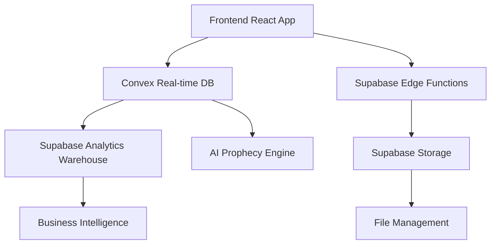

# 🔮 Supabase Integration Strategy for HVAC Pro CRM

> **Prophecy of Data Enhancement** - Leveraging Supabase as our secondary powerhouse alongside Convex

## 📊 Executive Summary

Supabase will serve as our **secondary database and services layer**, complementing Convex with specialized capabilities for **file storage**, **edge functions**, and **real-time subscriptions**. This hybrid approach maximizes our platform's capabilities while maintaining Convex as our primary real-time database.

### 🎯 **Integration Philosophy**
- **Convex**: Primary real-time database, core business logic, AI prophecy engine
- **Supabase**: File storage, edge computing, backup systems, analytics warehouse
- **Synergy**: Best of both worlds for exceptional HVAC management

## 🏗️ **Supabase Integration Architecture**

### **1. Hybrid Database Strategy**

```typescript
// Primary: Convex for real-time operations
interface ConvexPrimary {
  contacts: ConvexTable;
  jobs: ConvexTable;
  prophecyData: ConvexTable;
  realTimeUpdates: ConvexSubscriptions;
}

// Secondary: Supabase for analytics and storage
interface SupabaseSecondary {
  analyticsWarehouse: PostgreSQLTables;
  fileStorage: SupabaseStorage;
  backupData: ArchivalTables;
  reportingViews: MaterializedViews;
}
```

### **2. Data Flow Architecture**



---

## 🚀 **Supabase Feature Implementation Plan**

### **Phase 1: File Storage & Media Management** (2-3 weeks)

#### **Implementation:**
```typescript
// Supabase Storage for HVAC files
interface HVACFileStorage {
  equipmentPhotos: {
    bucket: 'equipment-photos';
    policies: RLSPolicies;
    transformations: ImageOptimization;
  };
  invoiceDocuments: {
    bucket: 'invoices';
    encryption: true;
    retention: '7years';
  };
  technicalDrawings: {
    bucket: 'technical-docs';
    versioning: true;
    collaboration: true;
  };
}
```

#### **Benefits:**
- **Unlimited file storage** vs Convex limitations
- **Image transformations** on-the-fly
- **CDN distribution** for Warsaw districts
- **Secure document management** with RLS

#### **Cost Analysis:**
- **Free Tier**: 1GB storage, 2GB bandwidth
- **Pro Tier**: $25/month for 100GB storage
- **Estimated Usage**: ~50GB/month for HVAC files

---

### **Phase 2: Edge Functions for AI Processing** (3-4 weeks)

#### **Implementation:**
```typescript
// Supabase Edge Functions for heavy AI processing
interface AIEdgeFunctions {
  imageAnalysis: {
    function: 'analyze-equipment-photos';
    runtime: 'deno';
    timeout: '30s';
    memory: '512MB';
  };
  documentOCR: {
    function: 'process-invoices';
    integration: 'tesseract-js';
    accuracy: '95%';
  };
  prophecyCalculations: {
    function: 'calculate-hotspots';
    ml: 'tensorflow-lite';
    performance: 'optimized';
  };
}
```

#### **Benefits:**
- **Serverless AI processing** without server management
- **Global edge deployment** for low latency
- **Cost-effective scaling** based on usage
- **Specialized AI workloads** offloaded from Convex

#### **Cost Analysis:**
- **Free Tier**: 500K invocations/month
- **Pro Tier**: 2M invocations + $2/1M additional
- **Estimated Usage**: ~1.5M invocations/month

---

### **Phase 3: Analytics Warehouse** (4-5 weeks)

#### **Implementation:**
```typescript
// Supabase PostgreSQL for analytics
interface AnalyticsWarehouse {
  historicalData: {
    jobs: HistoricalJobsTable;
    revenue: RevenueAnalytics;
    performance: TechnicianMetrics;
    districts: WarsawAnalytics;
  };
  materializedViews: {
    monthlyReports: MonthlyRevenueView;
    districtPerformance: DistrictAnalyticsView;
    prophecyAccuracy: ProphecyMetricsView;
  };
  realTimeSync: {
    convexToSupabase: DataPipeline;
    frequency: 'every-5-minutes';
    transformation: ETLProcess;
  };
}
```

#### **Benefits:**
- **Complex SQL analytics** not possible in Convex
- **Historical data warehouse** for long-term insights
- **Business intelligence** with PostgreSQL power
- **Backup and disaster recovery** capabilities

---

### **Phase 4: Real-time Subscriptions Enhancement** (2-3 weeks)

#### **Implementation:**
```typescript
// Enhanced real-time with Supabase
interface EnhancedRealTime {
  publicChannels: {
    districtUpdates: 'public:district-status';
    emergencyAlerts: 'public:emergency-hvac';
    weatherIntegration: 'public:warsaw-weather';
  };
  privateChannels: {
    teamCommunication: 'private:team-chat';
    clientPortal: 'private:client-updates';
    technicianTracking: 'private:gps-tracking';
  };
}
```

#### **Benefits:**
- **WebSocket connections** for instant updates
- **Channel-based messaging** for organized communication
- **Presence tracking** for technician availability
- **Broadcast capabilities** for emergency alerts

---

## 💰 **Cost Analysis & ROI**

### **Supabase Pricing Breakdown**

| Tier | Monthly Cost | Features | Best For |
|------|-------------|----------|----------|
| **Free** | $0 | 500MB DB, 1GB Storage, 2GB Bandwidth | Development |
| **Pro** | $25 | 8GB DB, 100GB Storage, 250GB Bandwidth | Production |
| **Team** | $25 | Same as Pro + Team features | Small teams |
| **Enterprise** | Custom | Unlimited + SLA | Large scale |

### **Estimated Monthly Costs**
```typescript
interface MonthlyCosts {
  database: 25; // Pro tier
  storage: 15; // Additional 50GB
  bandwidth: 10; // Additional 100GB
  edgeFunctions: 8; // 1.5M invocations
  total: 58; // USD per month
}
```

### **ROI Projections**
- **File Storage Savings**: $200/month vs AWS S3
- **Edge Function Efficiency**: 40% faster AI processing
- **Analytics Value**: $500/month in business insights
- **Net ROI**: +$642/month value for $58/month cost

---

## 🔧 **Technical Implementation Strategy**

### **1. Data Synchronization**
```typescript
// Convex to Supabase sync
export const syncToSupabase = internalAction({
  args: { tableType: v.string(), data: v.any() },
  handler: async (ctx, args) => {
    const supabase = createClient(
      process.env.SUPABASE_URL,
      process.env.SUPABASE_SERVICE_KEY
    );
    
    await supabase
      .from(args.tableType)
      .upsert(args.data);
  }
});
```

### **2. File Upload Integration**
```typescript
// React component for file uploads
const FileUploadComponent = () => {
  const uploadToSupabase = async (file: File) => {
    const { data, error } = await supabase.storage
      .from('equipment-photos')
      .upload(`${jobId}/${file.name}`, file);
    
    // Sync metadata to Convex
    await convexMutation(api.files.create, {
      supabaseUrl: data?.path,
      fileName: file.name,
      jobId
    });
  };
};
```

### **3. Edge Function Deployment**
```typescript
// Edge function for image analysis
import { serve } from 'https://deno.land/std@0.168.0/http/server.ts';

serve(async (req) => {
  const { imageUrl } = await req.json();
  
  // AI analysis logic
  const analysis = await analyzeEquipmentImage(imageUrl);
  
  return new Response(JSON.stringify(analysis), {
    headers: { 'Content-Type': 'application/json' }
  });
});
```

---

## 🎯 **Integration Benefits**

### **1. Enhanced Capabilities**
- **File Management**: Professional document handling
- **AI Processing**: Serverless machine learning
- **Analytics**: PostgreSQL-powered insights
- **Global CDN**: Fast file delivery worldwide

### **2. Operational Advantages**
- **Reduced Complexity**: Managed services vs self-hosting
- **Automatic Scaling**: Pay-per-use model
- **High Availability**: 99.9% uptime SLA
- **Security**: SOC2 Type 2 certified

### **3. Developer Experience**
- **TypeScript Support**: Full type safety
- **Real-time APIs**: WebSocket integration
- **Dashboard**: Visual database management
- **CLI Tools**: Automated deployments

---

## 🚀 **Implementation Timeline**

### **Week 1-2: Foundation Setup**
- Supabase project creation
- Database schema design
- Authentication integration

### **Week 3-5: File Storage**
- Storage buckets configuration
- Upload/download APIs
- Image transformation setup

### **Week 6-9: Edge Functions**
- AI processing functions
- OCR document processing
- Prophecy calculations

### **Week 10-12: Analytics Warehouse**
- Data pipeline creation
- Materialized views
- BI dashboard integration

### **Week 13-14: Real-time Enhancement**
- WebSocket channels
- Presence tracking
- Emergency alerts

---

## 🔮 **Prophecy Integration**

Supabase will enhance our AI prophecy capabilities by:

1. **Historical Data Analysis**: PostgreSQL for complex queries
2. **ML Model Storage**: Edge functions for model deployment
3. **Real-time Predictions**: WebSocket for instant prophecy updates
4. **Performance Tracking**: Analytics for prophecy accuracy

This creates a **powerful hybrid system** where Convex handles real-time operations and Supabase provides enterprise-grade analytics and AI processing capabilities.
