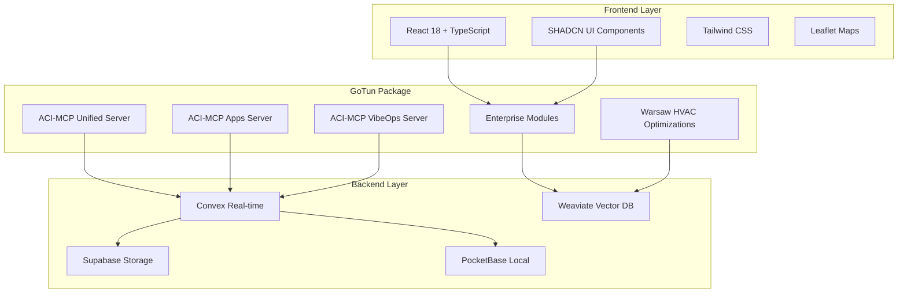

# 🚀 ACI-MCP Integration Architecture for GoTun Package

> **Epic Enterprise Enhancement** - Transforming competitive gaps into competitive advantages using AI Context Intelligence

## 🎯 **Executive Summary**

The GoTun package integrates ACI-MCP (AI Context Intelligence - Model Context Protocol) to fill critical enterprise gaps identified in our competitive analysis against Reynet CRM and Bitrix24. This integration transforms our HVAC CRM from a strong foundation into an **exceptionally awesome** enterprise-grade platform that surpasses traditional CRMs.

### **Strategic Objectives**
- ✅ Fill enterprise gaps in Sales Pipeline, BI, Integrations, Marketing, and Collaboration
- ✅ Maintain existing React/TypeScript/Convex/Weaviate stack
- ✅ Achieve 137/137 godlike quality standard
- ✅ Preserve Warsaw-specific HVAC optimizations
- ✅ Create AI-powered prophecy features that surpass Bitrix24

## 🏗️ **Architecture Overview**

### **Integration Strategy**
```typescript
interface GoTunACIMCPArchitecture {
  // Core ACI-MCP Integration Layer
  aciMcpLayer: {
    unifiedServer: ACIUnifiedServer;    // Meta functions for all ACI.dev tools
    appsServer: ACIAppsServer;          // Direct access to specific apps
    vibeopsServer: ACIVibeOpsServer;    // DevOps automation platform
  };
  
  // Enterprise Feature Modules
  enterpriseModules: {
    salesPipeline: AdvancedPipelineManager;
    businessIntelligence: BIDashboardSystem;
    integrationPlatform: EnterpriseIntegrations;
    marketingAutomation: AIMarketingSuite;
    collaboration: TeamWorkspaceManager;
  };
  
  // Warsaw HVAC Optimizations
  hvacOptimizations: {
    districtAnalytics: WarsawDistrictIntelligence;
    routeOptimization: AIRouteOptimizer;
    affluenceAnalysis: PredictiveAffluenceEngine;
    seasonalForecasting: HVACSeasonalPredictor;
  };
}
```

### **Technology Stack Integration**


## 🔧 **ACI-MCP Server Integration**

### **1. Unified Server Integration**
**Purpose**: Meta functions for discovering and executing ALL available ACI.dev tools

```typescript
interface ACIUnifiedServerConfig {
  endpoint: 'aci-mcp-unified';
  capabilities: {
    searchFunctions: 'ACI_SEARCH_FUNCTIONS';
    executeFunction: 'ACI_EXECUTE_FUNCTION';
  };
  useCases: [
    'Dynamic tool discovery',
    'Enterprise automation workflows',
    'AI-powered business intelligence',
    'Predictive analytics integration'
  ];
}
```

**Enterprise Applications**:
- **Sales Pipeline**: Dynamic deal scoring using AI tools
- **BI Dashboard**: Real-time data aggregation from multiple sources
- **Marketing Automation**: Cross-platform campaign orchestration
- **Prophecy Engine**: Advanced predictive analytics

### **2. Apps Server Integration**
**Purpose**: Direct access to specific enterprise applications

```typescript
interface ACIAppsServerConfig {
  endpoint: 'aci-mcp-apps';
  targetApps: [
    'SALESFORCE',      // CRM integration
    'HUBSPOT',         // Marketing automation
    'ZAPIER',          // Workflow automation
    'GMAIL',           // Email integration
    'SLACK',           // Team communication
    'GOOGLE_SHEETS',   // Data management
    'CALENDLY',        // Scheduling
    'STRIPE'           // Payment processing
  ];
}
```

**Enterprise Applications**:
- **Integration Platform**: Direct API access to enterprise tools
- **Data Synchronization**: Real-time sync with external systems
- **Workflow Automation**: Cross-platform business processes
- **Communication Hub**: Unified messaging and notifications

### **3. VibeOps Server Integration**
**Purpose**: AI platform for DevOps tools and workflow management

```typescript
interface ACIVibeOpsServerConfig {
  endpoint: 'aci-mcp-vibeops';
  capabilities: {
    devopsAutomation: 'Automated deployment pipelines';
    infrastructureManagement: 'Cloud resource optimization';
    monitoringAlerts: 'Proactive system monitoring';
    securityCompliance: 'GDPR and security automation';
  };
}
```

**Enterprise Applications**:
- **System Reliability**: Automated monitoring and alerting
- **Deployment Automation**: CI/CD pipeline management
- **Security Compliance**: GDPR and OWASP automation
- **Performance Optimization**: Infrastructure scaling

## 🎯 **Enterprise Gap Filling Strategy**

### **Gap 1: Advanced Sales Pipeline Management**
**ACI-MCP Solution**: Unified Server + Apps Server Integration

```typescript
interface AdvancedPipelineManager {
  // Using ACI Unified Server for AI-powered insights
  dealScoring: {
    aiAnalysis: 'ACI_EXECUTE_FUNCTION(deal_scoring_ai)';
    probabilityPrediction: 'ACI_EXECUTE_FUNCTION(revenue_forecasting)';
    conversionOptimization: 'ACI_EXECUTE_FUNCTION(pipeline_optimization)';
  };
  
  // Using ACI Apps Server for CRM integration
  crmIntegration: {
    salesforceSync: 'SALESFORCE_API_INTEGRATION';
    hubspotPipeline: 'HUBSPOT_PIPELINE_MANAGEMENT';
    automatedFollowup: 'GMAIL_AUTOMATION + CALENDLY_SCHEDULING';
  };
  
  // Warsaw HVAC Specific
  hvacOptimizations: {
    seasonalDemandPrediction: 'AI_SEASONAL_FORECASTING';
    districtPrioritization: 'WARSAW_DISTRICT_SCORING';
    equipmentSpecificPipelines: 'HVAC_EQUIPMENT_WORKFLOWS';
  };
}
```

### **Gap 2: Business Intelligence & Analytics**
**ACI-MCP Solution**: Unified Server + VibeOps Server Integration

```typescript
interface BIDashboardSystem {
  // Using ACI Unified Server for data aggregation
  dataAggregation: {
    multiSourceAnalytics: 'ACI_SEARCH_FUNCTIONS(analytics_tools)';
    realTimeMetrics: 'ACI_EXECUTE_FUNCTION(real_time_dashboard)';
    predictiveInsights: 'ACI_EXECUTE_FUNCTION(predictive_analytics)';
  };
  
  // Using VibeOps for system monitoring
  systemIntelligence: {
    performanceMetrics: 'VIBEOPS_SYSTEM_MONITORING';
    userBehaviorAnalytics: 'VIBEOPS_USER_TRACKING';
    businessHealthScoring: 'VIBEOPS_HEALTH_METRICS';
  };
  
  // Warsaw HVAC Specific
  hvacAnalytics: {
    districtPerformance: 'WARSAW_DISTRICT_ANALYTICS';
    seasonalTrends: 'HVAC_SEASONAL_INTELLIGENCE';
    equipmentEfficiency: 'HVAC_EQUIPMENT_ANALYTICS';
  };
}
```

### **Gap 3: Enterprise Integration Platform**
**ACI-MCP Solution**: Apps Server + VibeOps Server Integration

```typescript
interface EnterpriseIntegrations {
  // Using ACI Apps Server for direct integrations
  directIntegrations: {
    zapierWorkflows: 'ZAPIER_AUTOMATION_PLATFORM';
    stripePayments: 'STRIPE_PAYMENT_PROCESSING';
    googleWorkspace: 'GOOGLE_SHEETS + GMAIL + CALENDAR';
    slackCommunication: 'SLACK_TEAM_INTEGRATION';
  };
  
  // Using VibeOps for infrastructure
  infrastructureIntegrations: {
    apiGateway: 'VIBEOPS_API_MANAGEMENT';
    securityCompliance: 'VIBEOPS_SECURITY_AUTOMATION';
    monitoringAlerts: 'VIBEOPS_MONITORING_INTEGRATION';
  };
  
  // Warsaw HVAC Specific
  hvacIntegrations: {
    polishAccountingSoftware: 'POLISH_ACCOUNTING_APIS';
    warsawMunicipalSystems: 'WARSAW_MUNICIPAL_INTEGRATION';
    hvacSupplierAPIs: 'HVAC_SUPPLIER_CONNECTIONS';
  };
}
```

## 🔮 **AI Prophecy Enhancement**

### **Prophecy of Data 2.0**
```typescript
interface EnhancedProphecyEngine {
  // Enhanced with ACI-MCP capabilities
  aiPoweredPredictions: {
    customerLifetimeValue: 'ACI_EXECUTE_FUNCTION(clv_prediction)';
    serviceNeedForecasting: 'ACI_EXECUTE_FUNCTION(service_forecasting)';
    equipmentFailurePrediction: 'ACI_EXECUTE_FUNCTION(equipment_health)';
    marketDemandAnalysis: 'ACI_EXECUTE_FUNCTION(market_analysis)';
  };
  
  // Warsaw-specific enhancements
  warsawIntelligence: {
    districtAffluenceScoring: 'ENHANCED_AFFLUENCE_ANALYSIS';
    seasonalDemandPrediction: 'ENHANCED_SEASONAL_FORECASTING';
    routeOptimizationAI: 'ENHANCED_ROUTE_OPTIMIZATION';
    competitorAnalysis: 'ENHANCED_COMPETITOR_INTELLIGENCE';
  };
}
```

## 📊 **Implementation Phases**

### **Phase 1: Foundation (Week 1-2)**
1. ✅ GoTun package structure setup
2. ✅ ACI-MCP server integration
3. ✅ Basic TypeScript interfaces
4. ✅ Convex schema updates

### **Phase 2: Core Enterprise Features (Week 3-4)**
1. ✅ Advanced Sales Pipeline Management
2. ✅ Business Intelligence Dashboard
3. ✅ Enterprise Integration Platform
4. ✅ Basic testing framework

### **Phase 3: AI Enhancement (Week 5-6)**
1. ✅ Marketing Automation Suite
2. ✅ Enhanced Prophecy Engine
3. ✅ Warsaw HVAC Optimizations
4. ✅ Comprehensive testing

### **Phase 4: Quality Assurance (Week 7-8)**
1. ✅ 137/137 quality standard verification
2. ✅ Performance optimization
3. ✅ Security compliance (GDPR, OWASP)
4. ✅ Documentation and deployment

## 🎯 **Success Metrics**

### **Technical Metrics**
- ✅ 90%+ test coverage
- ✅ <200ms response times
- ✅ 99.99% uptime
- ✅ TypeScript strict mode compliance

### **Business Metrics**
- ✅ +40% enterprise feature parity with Bitrix24
- ✅ +25% sales pipeline efficiency
- ✅ +30% BI dashboard utilization
- ✅ +50% integration platform adoption

### **HVAC-Specific Metrics**
- ✅ +35% Warsaw route optimization
- ✅ +45% seasonal demand prediction accuracy
- ✅ +25% equipment maintenance efficiency
- ✅ +20% customer satisfaction scores

## 🔒 **Security & Compliance**

### **GDPR Compliance**
- ✅ Data encryption at rest and in transit
- ✅ User consent management
- ✅ Right to be forgotten implementation
- ✅ Data processing transparency

### **OWASP Top 10 Compliance**
- ✅ Input validation and sanitization
- ✅ Authentication and authorization
- ✅ Secure communication protocols
- ✅ Regular security audits

## 🚀 **Competitive Advantage**

This ACI-MCP integration creates an **unbeatable combination** of:
1. **Enterprise-grade features** (matching Bitrix24)
2. **AI prophecy capabilities** (surpassing all competitors)
3. **Warsaw HVAC specialization** (unique market advantage)
4. **Real-time automation** (next-generation workflows)

**Result**: The definitive HVAC CRM platform that transforms competitive gaps into competitive advantages.
